# 섹션 1 Spring Security Fundamentals

## 초기화 과정 이해

### SecurityBuilder / SecurityConfigurer


- SecurityBuilder : 빌더 클래스로서 웹보안을 구성하는 **빈객체와 설정 클래스들을 생성**. WebSecurity와 HttpSecurity가 있음.
- SecurityConfigurer : Http요청과 관련된 보안처리 **필터들을 생성**하고 여러 **초기화 설정**에 관여함.
- -> SecurityBuilder는 SecurityConfigurer를 포함하고 있으며 인증 및 인가 초기화 작업은 SecurityConfigurer에 의해 진행됨.
  
- SecurityBuilder를 구현한 WebSecurity : apply(SecurityConfigurer) -> 초기화 대상을 적용함
- WebSecurity : 먼저 초기화 작업에 관여함, -> FilterChainProxy 를 생성하여 반환
- HttpSecurity : 초기화 작접 진행 후 -> SecurityFilterChain를 생성하여 반환
- FilterChainProxy가 SecurityFilterChain에 의존 -> 사용자 요청 처리시 필터 체인을 실행

#### CustomSecurityConfigurer 만들기

- 먼저 시큐리티 필터체인 타입의 빈 생성하기

```java

@Configuration
public class SecurityConfig {
    /**
     * 시큐리티 필터체인 타입의 빈 생성하기
     * HttpSecurity.build()하여 SecurityFilterChain를 생성할 수 있다.
     */
    @Bean
    SecurityFilterChain securityFilterChain(HttpSecurity httpSecurity) throws Exception {
        httpSecurity.authorizeRequests().anyRequest().authenticated();
        httpSecurity.formLogin();
        //SecurityFilterChain에 추가하기
        httpSecurity.apply(new CustomSecurityConfigurer().setFlag(false)); //apply를 통하여 SecurityConfigurer를 추가한다.
        return httpSecurity.build();

    }
}

public class CustomSecurityConfigurer extends AbstractHttpConfigurer<CustomSecurityConfigurer, HttpSecurity> {

    private boolean isSecure;

    @Override
    public void init(HttpSecurity builder) throws Exception {
        super.init(builder);
        System.out.println("CustomSecurityConfigurer.init");
    }

    @Override
    public void configure(HttpSecurity builder) throws Exception {
        super.configure(builder);
        System.out.println("CustomSecurityConfigurer.configure");
        if (isSecure) {
            System.out.println("https is required");
        } else {
            System.out.println("https is optional");
        }
    }

    // 체이닝 메서드를 위한 this 반환
    public CustomSecurityConfigurer setFlag(boolean isSecure) {
        this.isSecure = isSecure;
        return this;
    }
}
```

### 자동 설정에 의한 초기화 진행

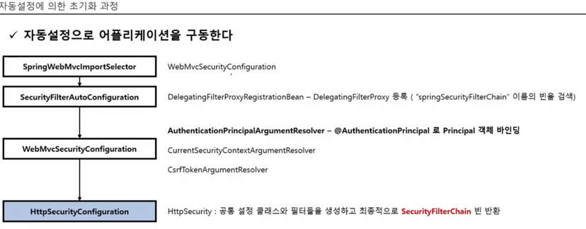

- 순서
- -> SpringWebMvcImportSelector
- -> SecurityFilterAutoConfiguration
- -> WebMvcSecurityConfiguration
- -> HttpSecurityConfiguration (중요) -> HttpSecurity 생성
- -> SpringBootWebSecurityConfiguration --> HttpSecurity 설정을 자동으로 하는 시큐리티 기본 설정 클래스
- -> WebSecurityConfiguration (중요) -> WebSecurity 생성
- -> WebSecurity -> 최종적으로 FilterChainProxy 생성됨

#### SpringWebMvcImportSelector

- 인터페이스 ImportSelector를 구현한 클래스
- -> 어떤 **조건에 따라서 설정 클래스를 로드**해야할 때 ImportSelector를 사용해서 로드할 수 있음.

#### SecurityFilterAutoConfiguration

- DelegatingFilterProxyRegistrationBean 빈을 생성 -> DelegatingFilterProxy를 등록
- -> DelegatingFilterProxy : "springSecurityFilterChain"이름의 빈을 검색해서 클라이언트의 요청을 빈에게 위임하는 클래스
- -> "springSecurityFilterChain"의 이름을 가진 빈이 FilterChainProxy라는 클래스임

#### WebMvcSecurityConfiguration

- ArgumentResolver 타입의 클래스를 생성함
- -> AuthenticationPrincipalArgumentResolver -> @AuthenticaionPrincipal 로 Principal 객체 바인딩
- -> CurrentSecurityContextArgumentResolver
- -> CsrfTokenArgumentResolver

#### HttpSecurityConfiguration

- HttpSecurity를 생성 (싱글톤이 아닌 프로토타입 빈) -> 생성할 때마다 각각의 빈이 생성됨
- ->  HttpSecurity : 공통 설정 클래스와 필터들을 생성하고, 최종적으로 SecurityFilterChain 빈 반환

#### SpringBootWebSecurityConfiguration

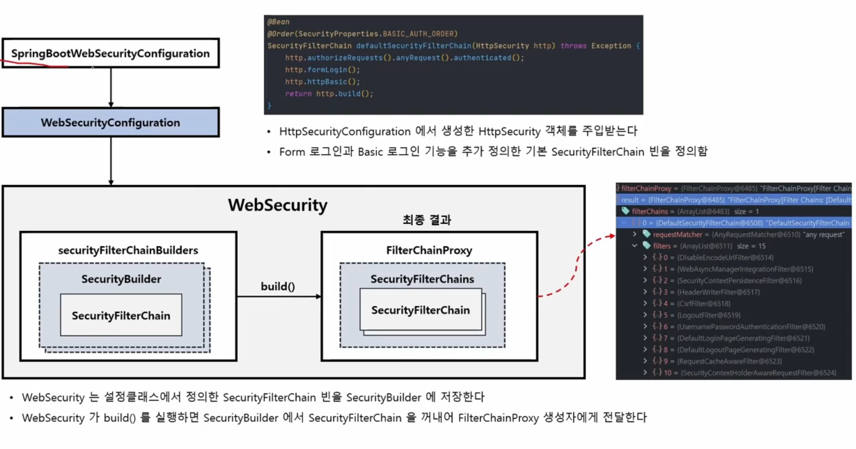

- -> HttpSecurity 설정을 자동으로 하는 시큐리티 기본 설정 클래스
- -> HttpSecurityConfiguration에서 생성한 HttpSecurity 객체를 주입받는다.
- -> defaultSecurityFilterChain()을 호출하여 기본 설정으로 HttpSecurity build()를 호출하고 SecurityFilterChain 빈을 정의함

#### WebSecurityConfiguration

- WebSecurityConfiguration는 WebSecurity를 설정한다
- WebSecurity는 설정 클래스에서 정의한 SecurifyFilterChain 빈을 SecurityBuilder에 저장한다.
- WebSecurity가 build()를 실행하면 SecurityBuilder에서 SecurityFilterChain을 꺼내어 FilterChainProxy 생성자에게 전달한다.

### 커스텀 설정에 의한 초기화 과정

- 설정 클래스를 커스텀하게 생성하기 때문에 SpringBootWebSecurityConfiguration의 SecurityFilerChainConfiguration 클래스가 구동되지 않는다.
- 사용자 정의 설정 클래스 생성 시 SecurityFilterChain와 WebSecurityConfigurerAdapter 두가지 모두 설정할 수 없으며 하나만 정의해야함

### AuthenticationEntryPoint 이해

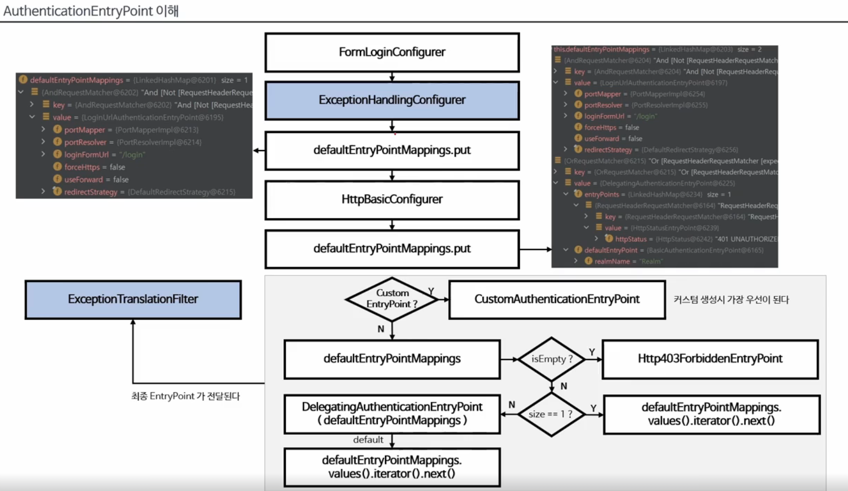

- 인증에 실패했을 경우 후속작업에 대한 정의를 AuthenticationEntryPoint에서 할 수 있다.
- 시큐리티는 초기화 때 기본으로 두 개의 인증방식을 설정함 -> FormLoginConfigurer, HttpBasicConfigurer
- 각각의 인증 상황에서 인증 예외가 발생했을 때 시큐리티는 AuthenticationEntryPoint를 통해서 인증예외 이후에 어떻게 할 것인지 결정하게 하는 클래스
- **ExceptionHandlingConfigurer**에서 AuthenticationEntryPoint에 대한 설정을 진행
- **formLogin** 인증 시 : ExceptionHandlingConfigurer가 **LoginUrlAuthenticationEntryPoint**를 전달 받은 후
- -> defaultEntryPointMappings 맵에 저장
- **httpBasic** 인증 시 : ExceptionHandlingConfigurer가 **BasicAuthenticationEntryPoint**를 전달 받은 후
- -> defaultEntryPointMappings 맵에 저장
- **커스텀 인증** 시 : ExceptionHandlingConfigurer가 커스텀EntryPoint를 전달 받은 후
- -> defaultEntryPointMappings 맵에 저장 -> **커스텀 EntryPoint가 가장 우선**시 됨
- 커스텀 인증을 만들었으나 EntryPoint 없는 경우 -> Http403ForbiddenEntryPoint 가 저장됨
- **ExceptionTranslationFilter** : ExceptionHandlingConfigurer가 EntryPoint를 최종적으로 ExceptionTranslationFilter에 전달하여 저장함

## 시큐리티 기본

### 시큐리티 인증 및 인가 흐름 요약

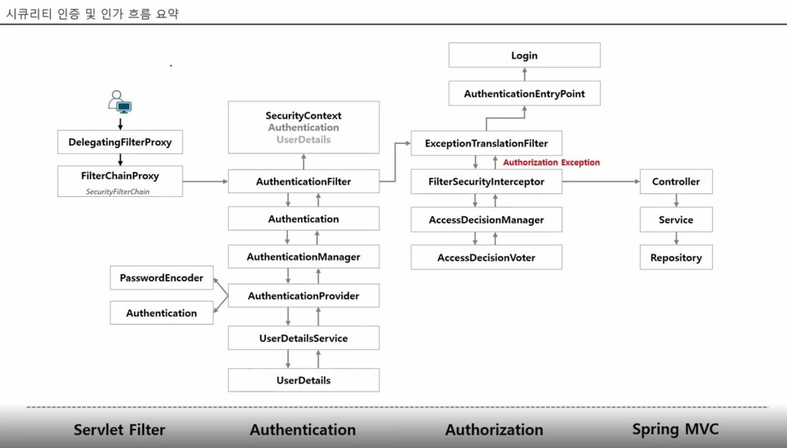

#### ServletFilter 부분

##### DelegatingFilterProxy

- 사용자가 요청을 시도 (인증이나 단순 접근 포함)
- -> 사용자 요청을 먼저 받는 곳은 스프링 컨테이너가 아닌 서블릿 컨테이너이기 때문에 프록시를 사용

##### FilterChainProxy

- 사용자 요청을 필터 처리

#### Authentication 부분

- 인증이 된 상태에선 해당 부분 건너뛴다.

##### AuthenticationFilter

- 일반적으로 UsernamePasswordAuthenticationFilter를 많이 사용
- -> Authentication 객체를 만드는 역할

##### AuthenticationManager

- AuthenticationFilter가 Authentication를 만들어 AuthenticationManager에 전달
- AuthenticationManager는 실제 인증처리할 수 있는 개체를 찾아서 위임하는 역할

##### AuthenticadtionProvider

- 실제 인증을 처리하는 객체
- 전달받은 Authentication을 이용하여 관련 정보 DB등 조회
- 주입된 UserDetailsService에 Id 존재여부 판단 후
- UserDetails 생성 이후 주입된 PasswordEncoder를 통해 패스워드 일치 여부도 확인
- -> 성공시 권한등을 포함한 UserDetails로 인증된 Authentication 객체를 생성해 리턴

##### UserDetailsSerivce

- UserDetails 존재여부 판단하는 서비스 클래스
- 일반적으로 Repository 주입받아 DB에 username에 해당하는 유저정보 질의 후 성공하면 UserDetails 객체 생성 전달
- cf)이곳에서는 username으로 존재 여부 확인만. 패스워드 비교는 AuthenticadtionProvider에서

##### SecurityContext

- 인증 성공 시 AuthenticationFilter가 SecurityContext Authentication객체를 저장함
- SecurityContext는 전역적으로 사용됨

#### Authorization 부분

- 요청이 스프링 컨테이너 자원에 접근 가능 여부를 검증함

##### ExceptionTranslationFilter

- 인증 또는 인가 예외가 발생했을 경우 해당 필터에서 처리를 함

##### FilterSecurityInterceptor

- 인가 여부 판단하는 필터
- AccessDecisionManager 의존

##### AccessDecisionManager

- 접근을 허가할 것인지 여부 최종 판단
- AccessDecisionVoter 의존
- AccessDecisionVoter의 처리 결과를 받아 판단함

##### AccessDecisionVoter

- 현재 사용자가 접근하고자하는 자원에 권한이 있는지 여부 체크하여 결과를 AccessDecisionManager에 전달

### HttpBasic 인증

- 기본 방식인 세션 쿠기방식의 UsernamePasswordAuthenticaionFilter 방식이 아닌 HttpBasic 사용
- HttpBasic는 base64 인코딩을 통해서 아이디와 패스워드를 전달하여 인증처리
- 인증 프로토콜은 HTTP 인증 헤더에 기술되어있음.
- 주의) 쉽게 디코딩 가능하므로 반드시 HTTPS와 같은 TLS기술과 함께 사용해야함.

#### 순서

- 클라이언트는 인증정보 없이 서버로 접속을 시도
- 서버는 클라이언트에 인증 요구를 보냄
- -> 401 UnAuthorized 응답과 함께 헤더에 WWW-Authentication를 기술해서 realm(보안영역)과 Basic인증방법을 보냄
- 클라이언트가 서버로 접속할 때 Base64로 username과 password를 인코딩하고 Authorization 헤더에 보냄
- 성공하면 정상 상태 코드가 반환됨

#### HttpBasic 설정 클래스

##### HttpBasicConfigurer

- HttpBasic 인증에 대한 초기화, 속성에 대한 기본값 설정
- 기본 AuthenticationEntryPoint는 BasicAuthenticatinoEntryPoint이다
- 필터는 BasicAuthenticationFilter를 사용한다.

##### BasicAuthenticationFilter

- HttpBasic 인증 시 기본 필터
- BasicAuthenticationConverter를 사용해서 요청헤더에 기술된 인증정보의 유효성을 체크하며 Base64 인코딩된 username과 password를 추출한다.
- 인증 과정에서 UsernamePasswordAuthenticationToken 생성하여 인증 시도 -> ProviderManager -> DaoAuthenticationProvider
- 인증 성공 시 Authentication이 SecurityContext에 저장됨
- 인증 실패 시 Basic인증을 통해 다시 인증하라는 메시지를 표시하는 BasicAuthenticationEntryPoint가 호출됨
- 인증 후 세션 사용 미사용 경우에 따라 처리 흐름에 차이 있음
- -> 세션 사용하면 요청마다 인증하지 않지만 사용안하면 요청마다 인증과정 거침

```java

@Configuration
public class SecurityConfig {
    @Bean
    SecurityFilterChain securityFilterChain(HttpSecurity httpSecurity) throws Exception {
        httpSecurity.authorizeRequests().anyRequest().authenticated();
        httpSecurity.httpBasic() //HttpBasicConfigurer 설정
                .authenticationEntryPoint(new CustomAuthenticationEntryPoint()); //커스텀 EntryPoint설
        httpSecurity.sessionManagement().sessionCreationPolicy(SessionCreationPolicy.SATATELESS); // 설정하면 세션 없어져서 요청마다 인증 시도
        return httpSecurity.build();
    }
}
```

- 흐름
  
- 커스텀 엔트리 포인트

```java
public class CustomAuthenticationEntryPoint implements AuthenticationEntryPoint {
    @Override
    public void commence(HttpServletRequest request, HttpServletResponse response, AuthenticationException authException) throws IOException, ServletException {
        // WWW-Authenticate 라는 규약을 지키지 않으면 브라우저는 Basic인증창을 띄우지 않음!
        response.addHeader("WWW-Authenticate", "Basic realm=localhost");
        response.sendError(HttpStatus.UNAUTHORIZED.value(), HttpStatus.UNAUTHORIZED.getReasonPhrase());
    }
}
```

### CORS 이해 (Cross Origin Resource Sharing, 교차 출처 리소스 공유)

- 웹 페이지가 자신의 출처가 아닌 다른 출처의 리소스에 접근할 때 브라우저는 별도의 통신 권한이 필요함 -> 시큐리티가 지원
- 웹 애플리케이션이 리소스가 자신의 출처와 다를 때 브라우저는 요청 헤더에 Origin 필드에 요청 출처를 함께 담아 교차 출처 HTTP 요청을 실행한다.
- 브라우저는 클라이언트의 요청헤더와 서버의 응답헤더를 비교해서 최종 응답을 결정함
- URL 구성요소 중 Protocol, Host, Post 세가지가 동일한지만 확인

#### CORS 요청의 종류 1 - Simple Request

- Simple Request는 예비요청(Preflight) 없이 서버에 요청을 한 후 서버가 응답헤더로 Access-Controll-Allow-Origin 과 같은 값을 전송하면 브라우저가 서로 비교 후
  CORS정책 위반여부를 검사
- 요청 제약사항들이 있다.

#### CORS 요청의 종류 2 - Preflight Request

- 브라우저가 예비요청을 보내는 것은 Prefilght라고 하며 요청 메소드에는 OPTIONS가 사용됨
- SimpleRequest의 제약사항을 벗어난 경우 브라우저는 PrefilghtRequest를 보낸다.
- Prefilght를 보낼 때 Origin에 대한 정보와 Access-Controll-Request-Headers, Access-Control-Request-Method로 본요청에 대한 정보도 일부 포함하여 요청
- 서버가 보낸 응답헤더의 Access-Control-Allow_Origin:주소... 의 의미는 해당 url 이의로 요청할 경우 CORS 위반이라는 의미

#### 동일출처기준

- https://(스킴)security.io(호스트)(포트)
- -> 스킴, 호스트, 포트가 동일해야함
- cf) 익스플로러는 포트를 무시함

#### CORS해결 - 서버에서 Access-Control-Allow-* 세팅

- Access-Control-Allow-Origin : 헤더에 작성된 출처만 허용
- Access-Control-Allow-Methods : preflight에 대한 응답으로 본요청에 사용할 수 있는 메서드를 나타냄
- Access-Control-Allow-Headers : preflight에 대한 응답으로 본요청에 사용할 수 있는 헤더 필드 이름을 나타냄
- Access-Control-Allow-Credential : 본요청에 쿠키나 인증등의 사용자 자격증명이 포함될 수 있음을 나타냄. Client의 credentials:include인 경우 true 필수
- Access-Control-Max-Age : prefight의 요청 결과를 캐시할 수 있는 시간을 나타내는 것으로 해당 기간 동안은 preflight를 하지 않게 된다.

#### 스프링 시큐리티 - CORS

##### CorsConfigurer

- SpringSecurity 필터 체인에 CorsFilter를 추가
- corsFilter라는 이름의 Bean이 제공되면 해당 CorsFilter 사용됨
- corsFilter라는 이름의 Bean이 없고 corsConfigurationSource 빈이 정의된 경우 해당 CorsConfiguration이 사용됨
- corsConfigurationSource빈이 정의되어 있지 않은 경우 Srping MVC가 클래스 경로에 있으면 HandlerMappingIntrospector가 사용됨 (시큐리티 없는 경우)

##### CorsFilter

- CORS 예비요청을 하고 CORS 단순 및 본 요청을 가로채고, 제공된 CorsConfigurationSource를 통해 일치된 정책에 따라
- -> CORS 응답헤더 와 같은 응답을 업데이트하기 위한 필터
- Spring MVC Java 구성과 Spring MVC XML 네임스페이스에서 CORS를 구성하는 대안이라 볼 수 있음(ex:CorsOrigin)
- 스프링웹에 의존하는 응용프로그램이나 javax.servlet에서 CORS 검사를 수행해야하는 보안 제약조건에 유용한 필터

```java

@Configuration
public class SecurityConfig {

    @Bean
    SecurityFilterChain securityFilterChain(HttpSecurity httpSecurity) throws Exception {
        httpSecurity.authorizeRequests().anyRequest().authenticated();
        httpSecurity.cors().configurationSource(corsConfigurationSource());
        return httpSecurity.build();
    }

    @Bean
    public CorsConfigurationSource corsConfigurationSource() {
        CorsConfiguration corsConfiguration = new CorsConfiguration();
        corsConfiguration.addAllowedOrigin("");
        corsConfiguration.addAllowedMethod("*");
        corsConfiguration.addAllowedHeader("*");
        corsConfiguration.setAllowCredentials(true);
        corsConfiguration.setMaxAge(3600L);
        UrlBasedCorsConfigurationSource source = new UrlBasedCorsConfigurationSource();
        source.registerCorsConfiguration("/**", corsConfiguration);
        return source;
    }
}
```

# 섹션 2 OAuth 용어 이해
- 

## The OAuth 2.0 Authorization Framework

## OAuth 2.0 Fundamentals

### OAuth 2.0 소개

- Open + Authorization
- 애플리케이션이 사용자를 대신하여 자원에 대한 엑세스를 얻기 위해 승인 상호 작용을 함으로 애플리케이션이 자체적으로 엑세스 권한을 얻도록 함
- 위임 인가 프레임워크 (Delegated authorization framework) -> 어플리케이션이 사용자의 데이터에 접근하도록 권한을 부여함

#### OAuth 이전 방식

- 클라이언트가 사용자 정보를 받아서 리소스 서버에 직접 인증
- -> 아이디 패스워드 노출되어 보안에 취약
- -> 리소스 서버의 모든 서비스를 제한 없이 사용 가능
- -> 클라이언트를 신뢰할 수 있는가

#### OAuth 2.0 방식

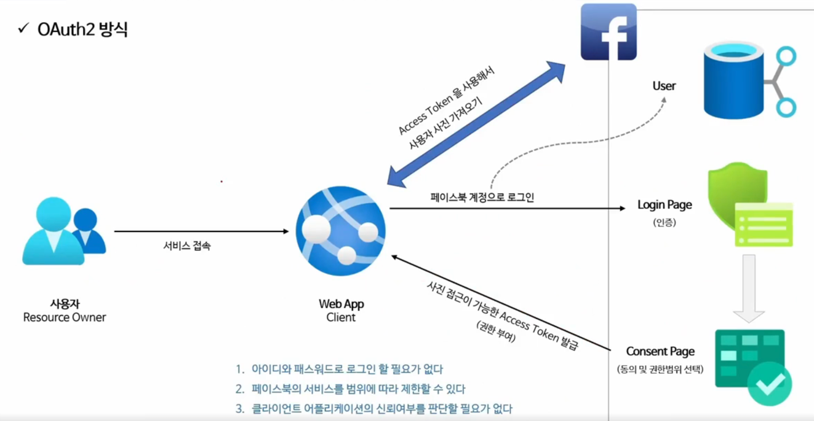
- 

### OAuth 2.0 용어 이해

#### keycloak 설치 및 설정

- ID 및 접근 관리를 지원하는 인가서버 오픈소스로 사용자 연합, 강력한 인증, 사용자 관리, 세분화된 권한 부여 등을 제공함
- 본 강의에 있어 OAuth2 Client와 Resource Server 커리큘럼에서 인가서버 플랫폼으로 사용한다.
- Spring Authorization Server 강의 이전까지 인가서버 테스트용으로 활용함.

#### OAuth 2.0 Roles

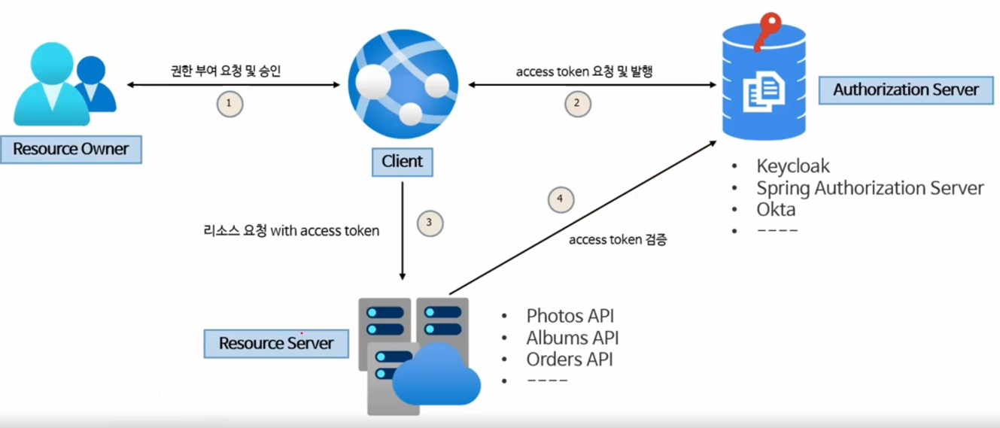

- OAuth 2.0 매커니즘은 다음 네가지 종류의 역할을 담당하는 주체들에 의해 이루어지는 권한 체계임
- 4단계 클라이언트의 accessToken 검증 시 리소스 서버가 자체 검증하거나 인가서버에 검증을 요청하는 두가지 방식 존재
- 보통 인가서버와 리소스 서버 분리되어 있지만 통합된 경우도 존재함

##### 1 Resource Owner (자원 소유자)

- 보호된 자원에 대한 **접근 권한을 부여할 수 있는 주체**, 사용자로서 계정의 일부에 대한 접근 권한을 부여하는 사람
- 사용자를 대신하여 작동하려는 모든 **클라이언트는 먼저 사용자의 허가를 받아야한다**.

##### 2 Resource Server (보호자원서버)

- 타사 어플리케이션에서 접근하는 **사용자의 자원이 포함된 서버**를 의미함
- 엑세스 토큰을 수락 및 검증할 수 있어야 하며 권한 체계에 따라 요청을 승인할 수 있어야한다.

##### 3 Authorizaion Server (인가서버)

- 클라이언트가 사용자 계정에 대한 동의 및 접근을 요청할 때 상호작용하는 서버로서 클라이언트의 권한 부여 요청을 승인하거나 거부하는 서버
- 사용자가 클라이언트에게 권한 부여 요청을 승인한 후 access token을 클라이언트에게 부여하는 역할

##### 4 Client (클라이언트)

- 사용자를 대신하여 **권한을 부여받아 사용자의 리소스에 접근하려는 어플리케이션**
- 사용자를 권한 부여 서버로 안내하거나 사용자의 상호 작용 없이 권한 부여 서버부터 직접 권한을 얻을 수 있다.

###### cf) 권한 부여 방식 - Authorization Code Grant Type

- 클라이언트가 인가서버에게 토큰을 발급 받기 전 먼저 **임시 코드**를 발급받음
- 그 임시코드를 가지고 다시 인가서버로 가서 2차적으로 토큰을 발급받는 방식

#### OAuth 2.0 Client Types

##### 개요

- **인증 서버에 클라이언트를 등록**할 때 클라이언트 자격 증명인 **클라이언트 아이디와 클라이언트 암호**를 받는다
- 클라이언트 암호는 비밀이고 그대로 유지되어야 하는 반면 클라이언트 아이디는 공개이다.
- 이 자격 증명은 **인증 서버에 대한 클라이언트 ID를 증명**한다.

##### 기밀 클라이언트

- **기밀 클라이언트는 client_secret의 기밀성을 유지**할 수 있는 클라이언트를 의미.
- 일반적으로 사용자가 엑세스할 수 없는 서버에서 실행되는 응용프로그램 (웹앱)

##### 공개 클라이언트

- 공개 클라이언트에서는 client_secret의 기밀을 유지할 수 없으므로 이러한 앱에는 secret이 사용되지 않음 (클라이언트앱)
- 기밀정보 유출가능성이 존재하여 공개로 간주
- 리소스 소유자가 사용하는 장치에서 실행되는 모든 클라이언트는 공개 클라이언트로 간주되어야함.

#### OAuth 2.0 Token Types

##### AccessToken

- 클라이언트에서 사용자의 보호된 리소스에 접근하기 위해 사용되는 일종의 자격증명
- 리소스 소유자가 클라이언트에 부여한 권한 부여의 표현
- 일반적으로 jwt 사용하지만 사양에 따라 달라짐
- 토큰에는 해당 엑세스기간, 범위 및 서버에서 필요한 기타 정보가 있음
- 타입에는 식별자 타입과 자체 포함 타입이 있음

##### RefreshToken

- 엑세스 토큰이 만료된 후 새 엑세스 토큰을 얻기 위해 클라이언트 응용 프로그램에서 사용하는 자격 증명
- 액세스 토큰이 만료된 경우 클라이언트는 권한 부여 서버로 인증하고 RefreshToken을 전달함.
- 인증 서버는 RefreshToken의 유효성을 검사하고 새 엑세스 토큰을 발급함
- RefreshToken은 엑세스 토큰과 달리 권한 서버 토큰 엔드포인트에만 보내고 리소스 서버에는 보내지 않는다.

##### ID Token

- OpenID Connect 챕터에서 학습함

##### Authorization Code

- 권한 부여 코드 흐름에서 사용되며 이 코드는 클라이언트가 엑세스 토큰과 교환할 **임시 코드**임
- 사용자가 클라이언트가 요청하는 정보를 확인하고 인가 서버로부터 리다이렉트되어 받아온다.

##### AccessToken 유형

###### AccessToken 유형 - 식별자 타입

- 인가서버는 저장소에 토큰의 내용을 저장하고 이 토큰에 대한 고유 식별자만 클라이언트에 발행함
- 이 토큰을 수신하는 API는 토큰의 유효성을 검사하기 위해 인가서버에 대한 백채널 통신을 열고 DB 조회해야한다.

###### AccessToken 유형 - 자체 포함 타입

- JWT 토큰 형식으로 발급되며 클레임 및 만료가 있는 보호된 데이터 구조이다
- 리소스 서버 API가 검증 키 등의 핵심 자료에 대해 알게되면 **발급자와 통신할 필요 없이 자체 포함된 토큰의 유효성을 검사할 수 있음**
- 특정 암호화 알고리즘에 의해 개인키로 서명되고 공개키로 검증할 수 있으며 만료될 때까지 유효하다.

### OAuth 2.0 Grant Types

#### 권한 부여 유형

- 권한부여란 클라이언트가 사용자를 대신해서 인가서버로부터 권한을 부여받는 것

##### Authorization Code Grant Type

- 권한 코드 부여 타입. 서버 사이드 어플리케이션 , 보안에 가장 안전

##### Implicit Grant Type (Deprecated)

- 암시적 부여 타입, 공개 클라이언트 어플리케이션, 보안에 취약

##### Resource Owner Password Credentials Grant Type (Deprecated)

- 리소스 사용자 비밀번호 자격증명 부여 타입, 서버 어플리케이션, 보안에 취약

##### Client Credentials Grant Type

- 별도의 사용자가 없는 타입 (클라이언트가 사용자 역할)
- 클라이언트 자격 증명 권한 부여 타입, UI or 화면이 없는 서버 어플리케이션
- 클라이언트 아이디, 클라이언트 시크릿만 있으면 인가서버로부터 엑세스 토큰 발급 받음

##### Refresh Token Grant Type

- 리프레시 토큰으로 별도의 권한 부여 과정을 다시 거치지 않는 방식
- 새로고침 토큰 부여 타입, Authorization Code, Resource Owner Password Type에서 지원

##### PKCE-enhanced Authorization Code Grant Type

- poof key code exchange
- Authorization Code Grant Type의 강화된 버전
- PKCE 권한 코드 부여 타입, 서버 사이드 어플리케이션, 공개 클라이언트 어플리케이션

##### 권한 부여 흐름 선택 기준

#### 매개변수 용어

##### client_id

- 인가서버에 등록된 클라이언트에 대해 생성된 고유 키

##### client_secret

- 인가서버에 등록된 특정 클라이언트의 client_id에 대해 생성된 비밀 값

##### response_type

- 애플리케이션이 권한부여 코드 흐름을 시작하고 있음을 인증서버에 알려준다.
- code, token, id_token 이 있으며 token, id_token은 implicit 권한부여유에서 지원해야한다.
- 서버가 쿼리 문자열에 인증코드(code), 토큰(token, id_token) 등을 반환

##### grant_type

- 권한 부여 타입 지정 : authorization_code, password, client_credential, refresh_token

##### redirect_uri

- 사용자가 응용 프로그램을 성공적으로 승인하면 권한 부여 서버가 사용자를 다시 응용 프로그램으로 리디렉션한다.
- redirect_uri 가 초기 권한 부여 요청에 포함된 경우 서비스는 토큰 요청에서도 이를 요구해야한다.
- 토큰 요청의 redirect_uri는 인증 코드를 생성할 때 사용된 redirect_uri와 정확하게 일치해야한다. 그렇지 않으면 서비스는 요청을 거부해야한다.

##### scope

- 어플리케이션이 사용자 데이터에 접근하는 것을 제한하기 위해 사용됨
- 사용자에 의해 특정 스코프로 제한된 권한 인가권을 발행함으로써 데이터 접근을 제한한다.

##### state

- 응용프로그램은 임의의 문자열을 생성하고 요청에 포함하고 사용자가 앱을 승인한 후 서버로부터 동일한 값이 반환되는지 확인해야한다.
- 이것은 csrf 공격을 방지하는데 사용함.

#### Authorization Code Grant Type

##### 흐름 및 특징

- 사용자가 애플리케이션을 승인하면 인가서버는 RedirectUrl로 임시 코드를 담아서 애플리케이션으로 다시 리다이렉션 한다.
- 애플리케이션은 해당 **임시 코드를 인가서버로 전달하고 엑세스 토큰으로 교환**환다.
- 애플리케이션이 **엑세스 토큰은 요청할 때 해당 요청을 클라이언트 암호로 인증**할 수 있으므로 공격자가 인증코드를 가로채서 스스로 사용할 위험이 줄어듬
- 엑세스 토큰이 사용자 또는 브라우저에 표시되지 않고 애플리케이션에 다시 저장하는 가장 안전한 방법이므로 토큰이 다른사람에게 누출될 위험이 줄어듬 (기밀 클라이언트)

##### 권한부코드 요청 시 매개변수 (임시코드 받는 로직)

- response_type = code (필수)
- client_id (필수)
- redirect_uri (선택)
- scope (선택)
- state (선택)

##### 엑세스토큰 교환 요청 시 매개변수

- grant_type=authorization_code (필수)
- code (필수)
- redirect_uri (필수: 리다이렉션 URL이 초기 승인 요청에 포함된 경우)
- client_id (필수)
- client_secret (필수)

##### 흐름

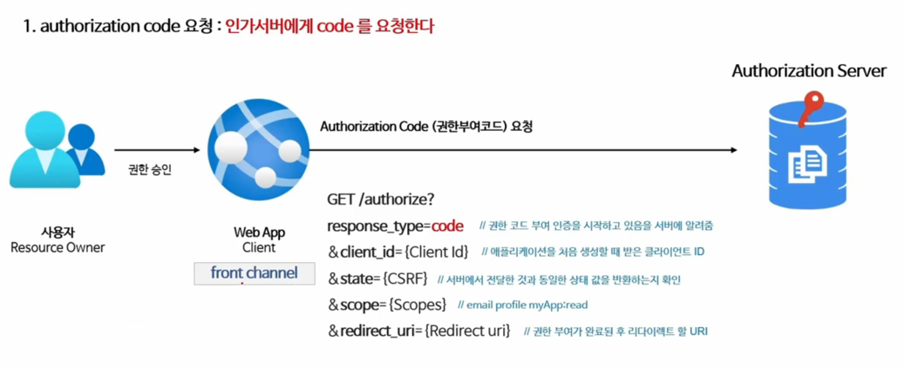

1. authorization code 요청 : 인가서버에 code를 요청한다.
   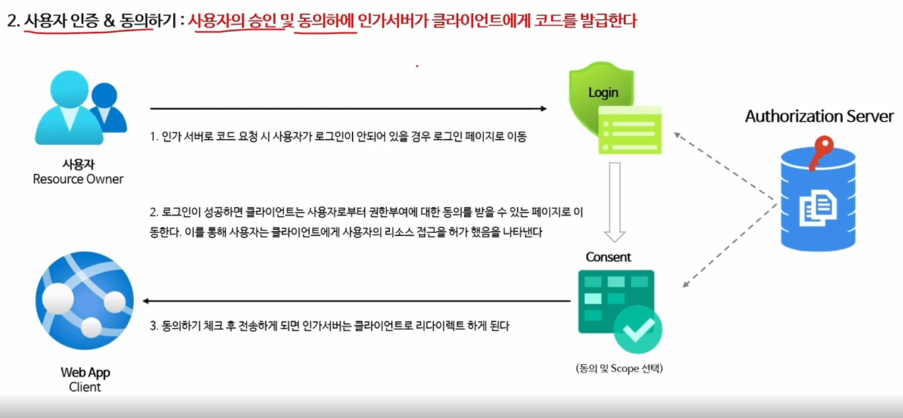
2. 사용자 인증 & 동의하기 : 사용자의 승인 및 동의하에 인가서버가 클라이언트에게 코드를 발급한다.
   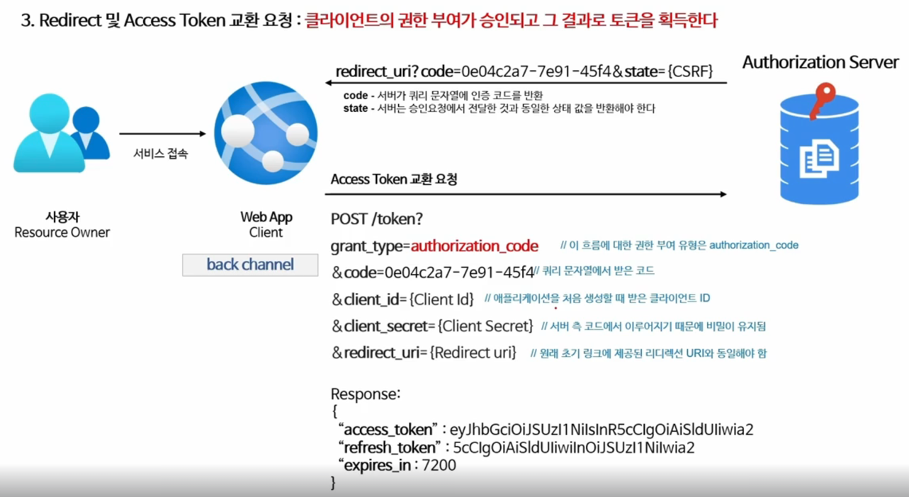
3. redirect 및 accessToken 교환 요청 : 클라이언트의 권한 부여가 승인되고 그 결과로 토큰을 획득한다.
   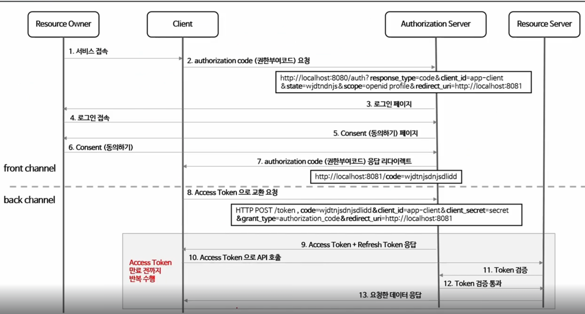

#### Implicit Grant (암묵적 승인)

##### 흐름 및 특징

- 공개 클라이언트에서 직접 API 요청
- 코드 교환 단계 건너 뛰고 액세스 토큰이 문자열 조각으로 클라이언트에 즉시 반환
- 이 유형은 back channel이 없으므로 refresh token을 사용하지 못함
- 토큰 만료 시 어플리케이션이 새로운 access token을 얻으려면 다시 OAuth 승인 과정을 거쳐야함

##### 권한 부여 승인 요청 시 매개변수

- respone_type=token (필수), id_token
- client_id (필수)
- redirect_url (필수)
- scope (선택사항)
- state (선택사항)

#### Resource Owner Password Credentials Grant

##### 흐름 및 특징

- 애플리케이션이 사용자 이름과 암호를 엑세스 토큰으로 교환할 때 사용된다.
- 타사 어플리케이션이 이 권한을 사용하도록 허용해서는 안되고 고도의 신뢰할 자사 어플리케이에서만 사용해야한다.

##### 권한 부여 승인 요청 시 매개변수

- grant_type=password(필수)
- username (필수)
- password (필수)
- client_id (필수)
- client_secret (필수)
- scope (선택사항)

##### 흐름

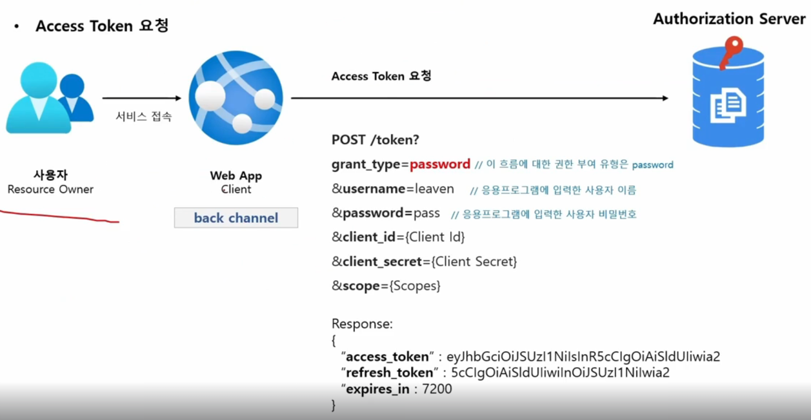

#### Client Credentials Grant Type - 클라이언트 자격증명 승인 방식

##### 흐름 및 특징

- 어플리케이션이 리소스 소유자임과 동시에 클라이언트 역할을 한다.
- 리소스 소유자에게 권한을 위임받아 리소스에 접근하는 것이 아니라 자기 자신이 애플리케이션을 사용할 목적으로 사용하는 것
- 서버대 서버간에 통신할 수 있으며 IOT같은 장비 어플리케이션과의 통신을 위한 인증으로도 사용할 수 있다.
- Client Id와 Client Secret을 통해 엑세스 토큰을 바로 발급받을 수 있기 때문에 RefreshToken을 제공하지 않는다
- Client 정보를 기반으로 하기 떄문에 사용자 정보를 제공하지 않는다

##### 권한 부여 승인 요청 시 매개변수

- grant_type=client_credentials (필수)
- client_id (필수)
- client_secret (필수)
- scope (선택사항)

#### Refresh Token Grant

##### 흐름 및 특징

- 엑세스 토큰이 발급될 때 함께 제공되는 토큰으로서 엑세스 토큰이 만료 되더라도 함께 발급받았던 리프레스 토큰이 유효하다면
- -> 인증 과정을 처음부터 반복하지 않아도 엑세스 토큰을 재발급 받을 수 있다.
- 한 번 사용된 리프레시 토큰은 폐기되거나 재사용할 수 있다.

##### 권한 부여 승인 요청 시 매개 변수

- grant_type=refresh_token (필수)
- refresh_token
- client_id (필수)
- client_secret (필수)

#### PKCE-enhanced Authorization Code Grant

##### PKCE 개요 (Proof Key For Code Exchange) 개요

- 코드 교환을 위한 증명 키로서 CSRF 권한부여코드 삽입 공격을 방지하기 위한 Authorization Code Grant Flow의 확장버전
- 권한부여코드 요청 시 Code Verifier와 Code Challenge를 추가하여 만약 Authorization Code Grant Flow에서 Authorization Code가 탈취 당했을 때
- -> AccessToken을 발급하지 못하도록 차단한다
- PKCE는 원래 모바일 앱에서 Authorization Code Grant Flow를 보호하도록 설계되었으며 나중에 단일 페이지 앱에서도 사용하도 권장되며
- -> 모든 유형의 OAuth2 클라이언트, 심지어 클라이언트 암호를 사용하는 웹 서버에서 실행되는 앱에서도 유용하다.

##### 코드 생성

###### 1 Code Verifier

- 권한부여코드 요청 전에 앱이 원래 생성한 PKCE 요청에 대한 코드 검증기

###### 2 Code Challenge

- 선택한 Hash 알고리즘으로 Code Verifier를 Hashing 한 후 Base64 인코딩을 한

###### 3 Code Challenge Method

- plain : Code Verifier가 특정한 알고리즘을 사용하지 않도록 설정
- S256 : Code Verifier 해시 알고리즘 사용하도록 설정

###### 흐름

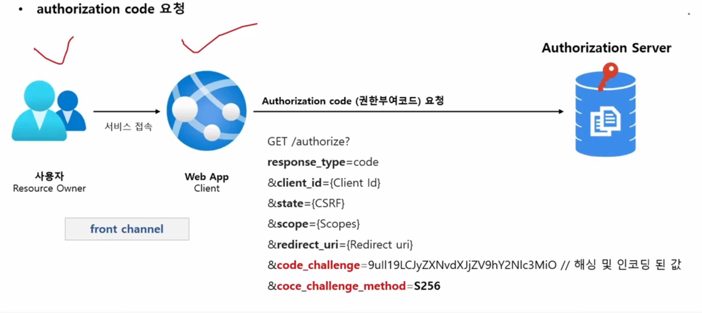
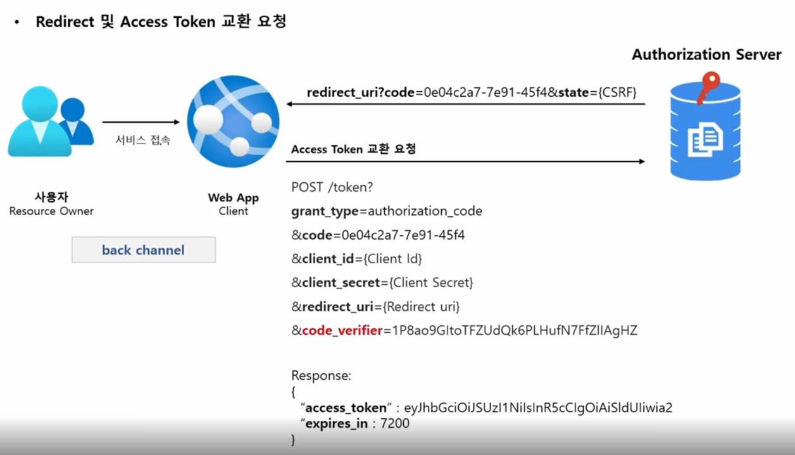

### Open ID Connect

#### 개요 및 특징


- Open Id Connect는 OAuth 2.0 프로토콜 위에 구축된 ID 계층, OAuth2.0을 확장하여 인증방식을 표준화한 OAuth2.0 기반의 인증 프로토콜
- scope 지정 시 "openid"를 포함하면 OpenID Connect 사용이 가능하며 인증에 대한 정보는 ID토큰 이라고하는 JWT로 반환된다.
- Open Id Connect는 클라이언트가 사용자 ID를 사용할 수 있게하는 보안 토큰인 ID Token을 제공한다.

##### OpenID Connect Discovery 1.0 Provider Metadata

- Open Id Connect 를 사용하기 위해 필요한 모든 엔드포인트 및 공개키 위 정보를 포함하여 OpenID 공급자의 구성에 대한 클레임 집합을 나타낸다.

#### ID Token & Scope

##### ID Token

- ID 토큰은 사용자가 인증 되었음을 증명하는 결과물로 OIDC요청 시 accessToken과 함께 클라이언트에 전달되는 결과물
- ID 토큰은 JWT로 표현되며 헤더, 페이로드 및 서명으로 구성됨
- ID 토큰은 개인 키로 발급자가 서명하는 것으로서 토큰의 출저를 보장하고 변조되지 않았음을 보장한다.
- 어플리케이션은 공개키로 ID 토큰을 검증 및 유효성을 검사하고 만료여부 등 토큰의 클레임을 확인한다.
- 클라이언트는 클레임 정보에 포함되어 있는 사용자명, 이메일을 활용하여 인증관리를 할 수 있다.

##### ID Token VS AccessToken

- ID Token은 API 요청에 사용되서는 안되며 사용자의 신원확인을 위해 사용되어져야 한다.
- AccessToken은 인증을 위해 사용되서는 안되며 리소스에 접근하기 위해 사용되어야한다.
  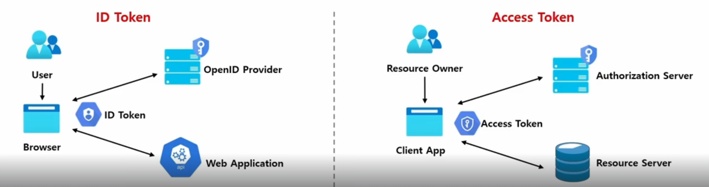

##### OIDC Scope

- openid : (필수) 클라이언트가 OpenID Connect 요청을 하고 있음을 인증 서버에 알린다
- profile : 기본 프로필 클레임에 대한 엑세스 요청
- email : 이메일 및 email_verified 클레임에 대한 엑세스 요청
- address : 주소 클레임에 대한 엑세스 요청
- phone : phone_number 및 phone_number_verified 클레임에 대한 엑세스 요청

##### OIDC 로그인 요청

###### OIDC 상호작용 행위자

- OpenID Provider : 줄여서 OP라고 하며 OpenID 제공자로서
- -> 최종 사용자를 인증하고 인증결과와 사용자에 대한 정보를 신뢰 당사자에(클라이언트)게 제공할 수 있는 OAuth2.0서버를 의미함
- Relaying Party : 줄여서 RP라고 하며 신뢰 당사자로서 인증 요청을 처리하기 위해 OP에 의존하는 OAuth2.0 어플리케이션(클라이언트)을 의미함

###### 흐름

- RP는 OP에 권한 부여 요청을 보낸다.
- OP는 최종 사용자를 인증하고 권한을 얻는다
- OP는 ID토큰과 엑세스 토큰으로 응답한다.
- RP는 AccessToken을 사용하여 UserInfo 엔드포인트에 요청을 보낼 수 있다.
- UserInfo 엔드포인트는 최종 사용자에 대한 클레임을 반환한다.

###### 매개변수 요청 및 응답

- 요청 시 openid 범위를 scope 매개변수에 포함해야함
- response_type 매개변수는 id_token을 포함함. (response_type이 해당 토큰을 지원해야함.)
- 요청은 nonce 매개변수를 포함해야함. (implicit flow인 경우 필수)
- -> 요청에 포함되는 값으로 결과 id_token 값에 클레임으로 포함되며 이것은 토큰의 재생공격을 방지하고 요청의 출처를 식별하는데 사용할 수 있는 임의의 고유 문자열이다.
- -> 해당 nonce 클레임에는 요청에서 전송된 것과 정확히 동일한 값이 포함되어야함. 그렇지 않은 경우 애플리케ㅣ션에서 인증 거부해야함.

## OAuth 2.0 Client

- OAuth2.0 인가 프레임워크 역할 중 인가 서버 및 리소스 서버와의 통신을 담당하는 **클라이언트의 기능을 필터 기반으로 구현**한 모듈
- 간단한 설정만으로 OAuth2.0 인증 및 리소스 접근 권한, 인가서버 엔드포인트 통신 등의 구현이 가능하며 확장이 용이.

### OAuth 2.0 Login

- 어플리케이션의 사용자를 외부 OAuth2.0 Provider나 OpenId Connect 1.0 Provider계정으로 로그인할 수 있는 기능을 제공
- 글로벌 서비스 프로바이더인 구글 계정으로 로그인, 깃허브 계정으로 로그인 기능을 OAuth2.0 로그인을 구현해 사용할 수 있도록 지원
- OAuth2.0 인가 프레임워크 권한 중 Authorization Code 방식을 사용

### OAuth 2.0 Client - OAuth2 클라리언트 기본 설명

- OAuth 2.0 인가 프레임워크에 정의된 클라이언트 역할을 지원한다
- 인가 서버의 권한 부여 유형에 따른 엔드 포인트와 직접 통신할 수 있는 API를 제공함
- Client Credentials
- Resource Owner Password Credentials
- Refresh Token
- 리소스 서버의 보호자원 접근에 대한 연동 모듈을 구현할 수 있음

#### OAuth 2.0 Client Fundamentals - OAuth2 클라이언트 주요 클래스 설명

##### application.yml / OAuth2ClientProperties

###### 클라이언트 권한 부여 요청 시작

- 클라이언트가 인가서버로 권한 부여 요청을 하거나 토큰 요청을 할 경우 클라이언트 정보 및 엔드포인트 정보를 참조해서 전달한다.
- application.yml 환경설정 파일에 클라이언트 설정과 인가서버 엔드포인트 설정을 한다.
- 초기화가 진행되면 application.yml에 있는 클라이언트 및 엔드포인트 정보가 OAuth2ClientProperties의 각 속성에 바인딩된다.
- OAuth2ClientProperties에 바인딩되어 있는 속성의 값은 인가서버로 권한부여 요청을 하기 위한 ClientRegistration 클래스의 필드에 저장된다.
- OAuth2Client는 ClientRegistration을 참조해서 권한부여 요청을 위한 매개변수를 구성하고 인가서버와 통신한다.

###### OAuth2ClientProperties

```yml
# 필수값이 아닌 값들은 메타데이터를 전달받아 생성가능
spring:
  security:
    oauth2:
      client:
        registration: # 클라이언트 설정
          keycloak:
            authorization-grant-type: authorization_code # OAuth 2.0 권한 부여 타입 
            client-id: oauth2-client-app # 서비스 공급자에 등록된 클라이언트 아이디 (필수값)
            client-name: oauth2-client-app # 클라이언트 이름 (필수값)
            client-secret: tynl8eYUw4H1fJYxwLQ36XhFC1Ge1w1x # 서비스 공급자에 등록된 클라이언트 비빌번호
            redirect-uri: http://localhost:8081/login/outh2/code/keycloak # 인가서버에서 권한 코드 부여 후 클라이언트로 리다이렉트 하는 위치 (필수값)
            clientAuthenticationMethod: client_secret_post # 클라이언트 자격증명 전송방식
            scope: openid, email # 리소스에 접근 제한 범위
      provider: #공급자 설정
        keycloak:
          authorization-uri: http://localhost:8080/realms/oauth2/protocol/openid-connect/auth # OAuth 2.0 권한 코드 부여 엔드 포인트
          issuer-uri: http://localhost:8080/realms/oauth2 # 서비스 공급자 위치 (필수값)
          jwk-set-uri: http://localhost:8080/realms/oauth2/protocol/openid-connect/certs # OAuth 2.0 JwkSetUri 엔드 포인트
          token-uri: http://localhost:8080/realms/outh2/protocol/openid-connect/token # OAuth 2.0 토큰 엔드 포인트
          user-info-uri: http://localhost:8080/realms/oauth2/protocol/openid-connect/userinfo # OAuth 2.0 UserInfo 엔드 포인트
          user-name-attribute: preferred_username # OAuth 2.0 사용자명을 추출하는 클레임명
```

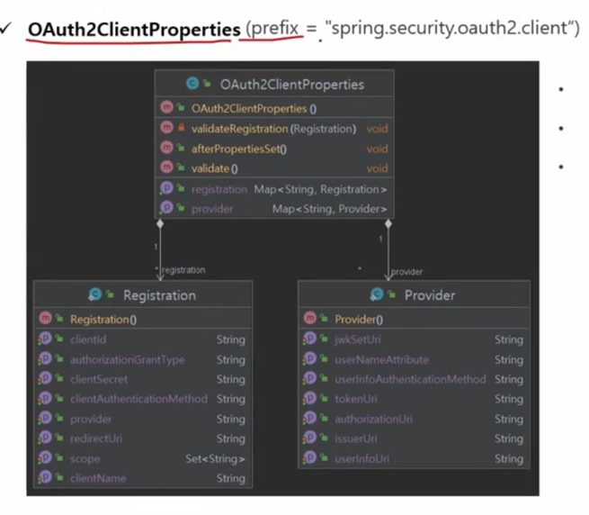

- Registration : 인가 서버에 등록된 클라이언트 및 요청 파라미터 정보를 나타냄
- Provider : 공급자에서 제공하는 엔드포인트 등의 정보를 나타냄
- 클라이언트 및 공급자의 정보를 registration / provider 맵에 저장하고 인가서버와의 통신시 각 항목을 참조하여 사용함.

##### ClientRegistration

- OAuth2.0 또는 OpenId Connect 1.0 Provider에서 클라이언트의 등록 정보를 나타낸다.
- ClientRegistration은 OpenID Connect Provider 설정 엔드포인트나 인가서버의 메타데이터 엔드포인트를 찾아 초기화할 수 있다
- 아래의 ClientRegistrations의 메서드를 사용하면 편리하게 ClientRegistration을 설정할 수 있다.

```
// https://idp.example.com/issuer (호스트 주소 (발행자의 기본 url))
ClientRegistration clientRegistration = ClientRegistrations.fromIssuerLocation("https://idp.example.com/issuer").build();
// 위 코드는 응답을 받을 때까지 아래 url에 차례로 질의함 
https://example.com/issuer/.well-known/openid-configuration, https://idp.example.com/.well-known/oauth-authorization-server
// Open Id Connect의 설정 엔드 포인트 및, 인가서버의 메타데이터 엔드포인트임
```

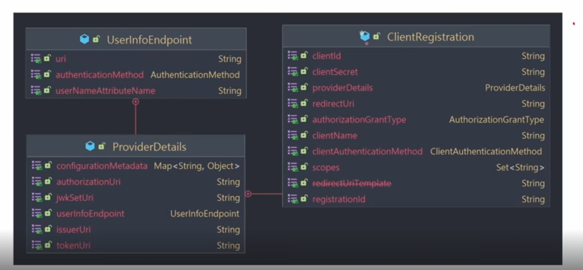

###### ClientRegistration 속성

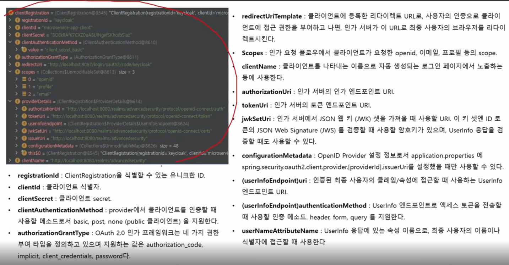

- clientAuthenticationMethod : provider에서 클라이언트를 인증할 떄 사용하는 메서드
- jwkSetUri : 인가서버에서 JSON 웹 키(JWK) 셋을 가져올 때 사용할 URI, 이 키 셋엔 ID 토큰의 JSON WEB SIGNATUR(JWS)를 검증할 때
- -> 사용할 암호키가 있으며 UserInfo응답을 검증할 때도 사용할 수 있다.
- configurationMetaData : OpenId Provider 설정 정보로서 application.properties에
- -> spring.security.oauth2.client.provider.[providerId].issuerUri(인가서버의 위치)를 설정했을 때만 사용할 수 있다.
- -> 인가서버의 메타데이터를 가져오는 것.
- (userInfoEndpoint)uri : 인증된 최종 사용자의 클레임/속성에 접근할 때 사용하는 UserInfo 엔드포인트 URI
- (userInfoEndpoint)authenticationMethod : UserInfo엔드포인트로 엑세스 토큰을 전송할 때 사용할 인증 메서드. header, form, query 지원
- userNameAttributeName : UserInfo 응답에 있는 속성 이름으로, 최종 사용자의 이름이나 식별자를 접근할 때 사용함.

##### CommonOAuth2Provider

- enum 클래스 -> 글로벌 Provider인 경우 Provider 정보를 별도로 입력, 전달할 필요가 없엊임 (issuer uri 없어도 됨)
- OAuth2.0 공급자 정보를 제공하는 클래스로서 글로벌 서비스 제공자 일부는 기본으로 제공되어짐
- ClientId와 ClientSecret 별도로 application.properties에 작성해야한다.
- 네이버 같은 국내 공급자 정보는 모든 항목을 수동으로 작성해야함
- 클라이언트 기준인 Registration 항목과 서비스 제공자 기준인 Provider 항목으로 구분되어 설정함
- application.properties가 아닌 Java Config 방식으로 ClientRegistration 등록을 설정할 수 있음
- ClientRegistration 객체를 생성할 수 있는 빌더 클래스를 반환함
  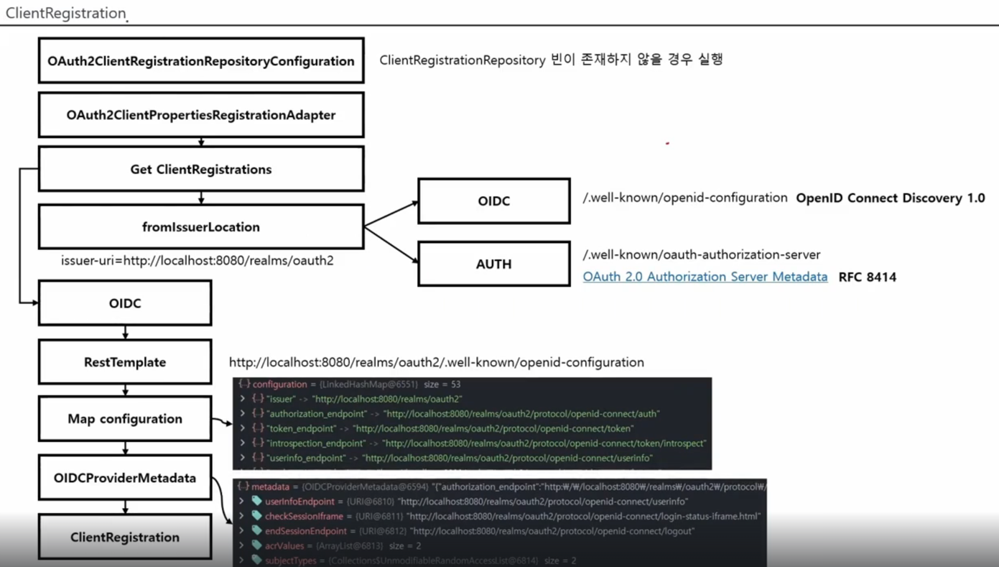

##### ClientRegistrationRepository

- ClientRegistrationRepository는 OAuth2.0과 Open Id Connect 1.0의 ClientRegistration 저장소 역할을 한다.
- 클라이언트 등록 정보는 궁극적으로 인가 서버가 저장하고 관리하는데 이 레포지토리는 인가서버에 일차적으로 저장된 클라이언트 등록 정보의 일부를 검색하는 기능을 한다.
- 스프링부트 2.x는 spring.security.oauth2.client.registration.[registrationId] 하위 프로퍼티를 ClientRegistration 인스턴스에 바인딩하며
- -> 각 ClientRegistration 객체는 ClientRegistrationRepository 안에 구성함
- ClientRegistration의 디폴트 구현체는 InMemoryClientRegistrationRepository임
- 자동 설정을 사용하면 ClientRegistrationRepositoy도 ApplicationContext 내 @Bean으로 등록하므로 필요하다면 원하는 곳에 의존성을 주입할 수 있다.

```java
/**
 * yml 설정방식이 아닌 자바 설정 방식으로 진행하는 경우
 */
@Configuration
public class OAuth2ClientConfig {
    @Bean
    public ClientRegistrationRepository clientRegistrationRepository() {
        return new InMemoryClientRegistrationRepository(keycloakClientRepository());
    }

    private ClientRegistration keycloakClientRepository() {
        return ClientRegistrations.fromIssuerLocation("http://localhost:8080/realms/oauth2")
                // 클라이언트 정보
                .registrationId("keycloak")
                .clientId("oauth2-client-app") //필수
                .clientSecret("Su4ATret5R17gTgst91YZgt67QCIDoua") //필수
                .redirectUri("http://localhost:8081/login/oauth2/code/keycloak")
                // 프로바이더 정보
//                .issuerUri("http://localhost:8080/realms/oauth2") //주지 않아도 실행됨
                .build();
    }
}
```

##### AuthenticationEntryPoint

##### 자동설정에 의한 초기화 과정  - OAuth2 클라이언트 초기화 과정 설명

- OAuth Client 기동 될 때 자동 설정 초기화 과정
- OAuth2ImportSelector : 조건에 맞는 설정 클래스 로드 (클래스패스에 현재 잡혀있는 클래스가 참일경우 해당 설정 클래스를 로드)
- -> **OAuth2ClientConfiguration**
- -> OAuth2ClientWebMvcImportSelector
- -> **OAuth2ClientWebMvcSecurityConfiguration** : 이 설정 클래스를 로드하기 위해 위 작업들이 필요함. 아래 두 클래스를 로드함
- --> **DefaultOAuth2AuthorizedClientManager** : 권한 부여 요청에 따라서 중요 클래스들을 의존
- ---> ClientRegistrationRepository, AuthorizedClientRepository, AuthorizedClientProvider를 의존
- ---> 클라이언트가 권한 부여 승인을 받을 수 있도록 관리하는 클래스, 이 클래스를 가지고 있으면 직접 인가서버에 요청해서 클라이언트가 권한 부여를 받을 수 있도록 함
- --> HandlerMethodArgumentResolver : OAuth2AuthorizedClientArgumentResolver에 위의 OAuth2AuthorizedClientManager를 담아 생성
- ---> **OAuth2AuthorizedClientArgumentResolver** : 클라이언트가 권한부여 승인을 받을 수 있도록 처리하는 리졸버(웹MVC에서 사용)

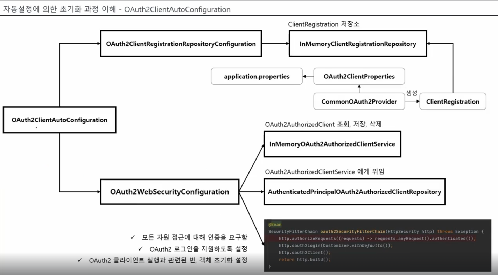

- **OAuth2ClientAutoConfiguration**
- -> OAuth2ClientRegistrationRepositoryConfiguration
- --> InMemoryClientRegistrationRepository -> ClientRegistration을 저장하고 있음
- ---> CommonOAuth2Provider가 OAuth2ClientProperties를 읽어서 ClientRegistration을 생성
- -> **OAuth2WebSecurityConfiguration** : 아래의 3개의 클래스를 생성
- --> InMemoryOAuth2AuthorizedClientService : OAuth2AuthorizedClient 조회, 저장, 삭제
- ----> **OAuth2AuthoriedClient** : 클라이언트가 인가서버로부터 권한부여최종승인되면 이 클래스에 승인 정보들이 저장됨
- --> AuthenticatedPrincipalOAuth2AuthorizedClientRepository : OAuth2AuthorizedClientService에게 위임
- --> **OAuth2SecurityFilterChain** : 모든 자원접근에 인증 요구, OAuth2로그인지원하도록 설정, OAuth2클라이언트 실행과 관련된 빈, 객체 초기화 설정


### OAuth2.0 클라이언트 로그인 - oauth2Login()


## OAuth 2.0 Resource Server

## OAuth 2.0 Authorization Server
