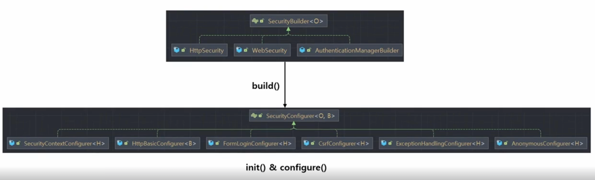
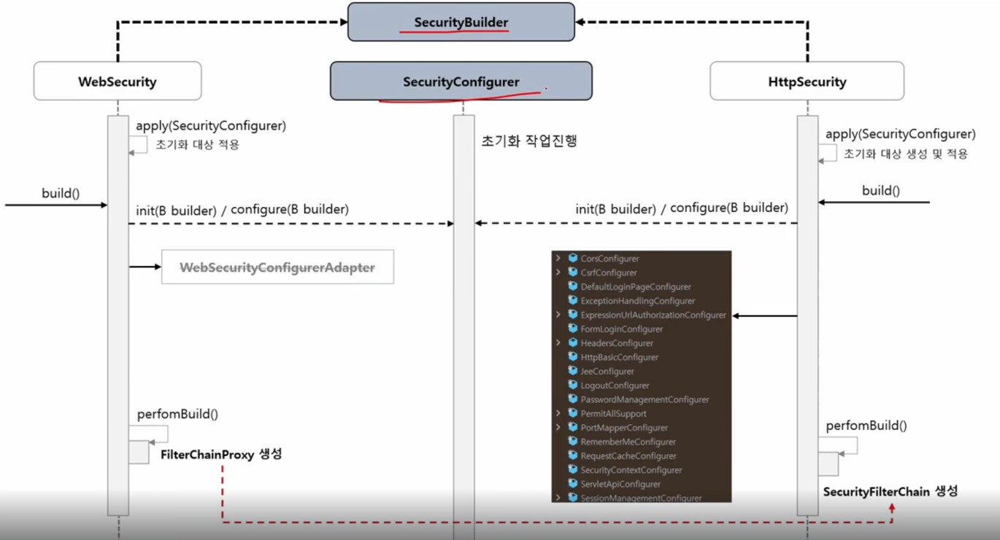

# 섹션 1 Spring Security Fundamentals
## 초기화 과정 이해
### SecurityBuilder / SecurityConfigurer

- SecurityBuilder : 빌더 클래스로서 웹보안을 구성하는 **빈객체와 설정 클래스들을 생성**. WebSecurity와 HttpSecurity가 있음.
- SecurityConfigurer : Http요청과 관련된 보안처리 **필터들을 생성**하고 여러 **초기화 설정**에 관여함.
- -> SecurityBuilder는 SecurityConfigurer를 포함하고 있으며 인증 및 인가 초기화 작업은 SecurityConfigurer에 의해 진행됨.

- SecurityBuilder를 구현한 WebSecurity : apply(SecurityConfigurer) -> 초기화 대상을 적용함
- WebSecurity : 먼저 초기화 작업에 관여함, -> FilterChainProxy 를 생성하여 반환 
- HttpSecurity : 초기화 작접 진행 후 -> SecurityFilterChain를 생성하여 반환
- FilterChainProxy가 SecurityFilterChain에 의존 -> 사용자 요청 처리시 필터 체인을 실행 
#### CustomSecurityConfigurer 만들기 
- 먼저 시큐리티 필터체인 타입의 빈 생성하기
```java
@Configuration
public class SecurityConfig {
    /**
     * 시큐리티 필터체인 타입의 빈 생성하기
     * HttpSecurity.build()하여 SecurityFilterChain를 생성할 수 있다.
     */
    @Bean
    SecurityFilterChain securityFilterChain(HttpSecurity httpSecurity) throws Exception {
        httpSecurity.authorizeRequests().anyRequest().authenticated();
        httpSecurity.formLogin();
        //SecurityFilterChain에 추가하기
        httpSecurity.apply(new CustomSecurityConfigurer().setFlag(false)); //apply를 통하여 SecurityConfigurer를 추가한다.
        return httpSecurity.build();

    }
}
public class CustomSecurityConfigurer extends AbstractHttpConfigurer<CustomSecurityConfigurer, HttpSecurity> {

    private boolean isSecure;

    @Override
    public void init(HttpSecurity builder) throws Exception {
        super.init(builder);
        System.out.println("CustomSecurityConfigurer.init");
    }

    @Override
    public void configure(HttpSecurity builder) throws Exception {
        super.configure(builder);
        System.out.println("CustomSecurityConfigurer.configure");
        if(isSecure){
            System.out.println("https is required");
        }else{
            System.out.println("https is optional");
        }
    }

    // 체이닝 메서드를 위한 this 반환
    public CustomSecurityConfigurer setFlag(boolean isSecure){
        this.isSecure = isSecure;
        return this;
    }
}
```
### 자동 설정에 의한 초기화 진행
- 순서
- -> SpringWebMvcImportSelector
- -> SecurityFilterAutoConfiguration
- -> WebMvcSecurityConfiguration
- -> HttpSecurityConfiguration (중요) -> HttpSecurity 생성
- -> SpringBootWebSecurityConfiguration --> HttpSecurity 설정을 자동으로 하는 시큐리티 기본 설정 클래스
- -> WebSecurityConfiguration (중요) -> WebSecurity 생성
- -> WebSecurity -> 최종적으로 FilterChainProxy 생성됨
#### SpringWebMvcImportSelector 
- 인터페이스 ImportSelector를 구현한 클래스
- -> 어떤 **조건에 따라서 설정 클래스를 로드**해야할 때 ImportSelector를 사용해서 로드할 수 있음.
#### SecurityFilterAutoConfiguration
- DelegatingFilterProxyRegistrationBean 빈을 생성 -> DelegatingFilterProxy를 등록
- -> DelegatingFilterProxy : "springSecurityFilterChain"이름의 빈을 검색해서 클라이언트의 요청을 빈에게 위임하는 클래스
- -> "springSecurityFilterChain"의 이름을 가진 빈이 FilterChainProxy라는 클래스임
#### WebMvcSecurityConfiguration
- ArgumentResolver 타입의 클래스를 생성함 
- -> AuthenticationPrincipalArgumentResolver -> @AuthenticaionPrincipal 로 Principal 객체 바인딩
- -> CurrentSecurityContextArgumentResolver
- -> CsrfTokenArgumentResolver
#### HttpSecurityConfiguration
- HttpSecurity를 생성 (싱글톤이 아닌 프로토타입 빈) -> 생성할 때마다 각각의 빈이 생성됨
- ->  HttpSecurity : 공통 설정 클래스와 필터들을 생성하고, 최종적으로 SecurityFilterChain 빈 반환
#### SpringBootWebSecurityConfiguration
- -> HttpSecurity 설정을 자동으로 하는 시큐리티 기본 설정 클래스
- -> HttpSecurityConfiguration에서 생성한 HttpSecurity 객체를 주입받는다.
- -> HttpSecurity의 build()를 호출하여 기본 설정으로 SecurityFilterChain 빈을 정의함 
### 커스텀 설정에 의한 초기화 과정
### AuthenticationEntryPoint 이해  
